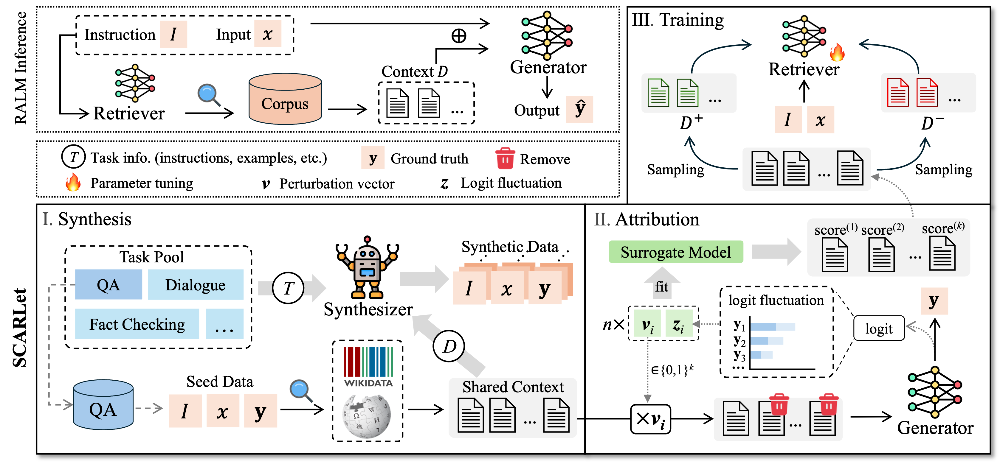

# SCARLet

This is the repository of **SCARLet** (Shared Context Attribution Supervised
Training for Utility-based Retrievers), from the paper: [Training a Utility-based Retriever Through Shared Context Attribution for Retrieval-Augmented Language Models.](https://arxiv.org/abs/2504.00573)


<p align="center">
  
</p>


## cmd

Preprocess training data, test data, and corpus
```
bash ./scripts/preprocess.sh > ./logs/preprocess.log
```

Extract entity list from seed data
```
bash ./scripts/entities_extraction.sh > ./logs/entities_extraction.log
```

Retrieve related entities from wikidata to expand the seed data entity list
```
bash ./scripts/entities_retrieval.sh > ./logs/entities_retrieval.log
```

Retrieve relevant passages from Wikipedia as a shared context based on a query constructed from a list of entities
```
bash ./scripts/passages_retrieval.sh > ./logs/passages_retrieval.log
```

Call the synthesizer to construct synthetic data for each task based on the shared context
```
bash ./scripts/data_synthesis.sh > ./logs/data_synthesis.log
```

Call the synthesizer to perform quality checks on the synthetic data and filter out unqualified data
```
bash ./scripts/data_filtering.sh > ./logs/data_filtering.log
```

Perform downstream attribution on synthetic data to obtain the utility score of each passage in the context
```
bash ./scripts/attribute.sh > ./logs/attribute.log
```

Sampling positive and negative samples for data labeled with utility scores (based on one-dimensional clustering method)
```
bash ./scripts/sample.sh > ./logs/sample.log
```

Training the Retriever
```
bash ./scripts/train.sh > ./logs/train.log
```

baseline-retrieval
```
bash ./scripts/baseline1.sh > ./logs/rag.log
```

baseline-generation
```
bash ./scripts/baseline2.sh > ./logs/generation.log
```


## Citation

If SCARLet is useful to you, please cite the following paper in your work:

```bibtex
@misc{xu2025trainingutilitybasedretrievershared,
      title={Training a Utility-based Retriever Through Shared Context Attribution for Retrieval-Augmented Language Models}, 
      author={Yilong Xu and Jinhua Gao and Xiaoming Yu and Yuanhai Xue and Baolong Bi and Huawei Shen and Xueqi Cheng},
      year={2025},
      eprint={2504.00573},
      archivePrefix={arXiv},
      primaryClass={cs.CL},
      url={https://arxiv.org/abs/2504.00573}, 
}
```
